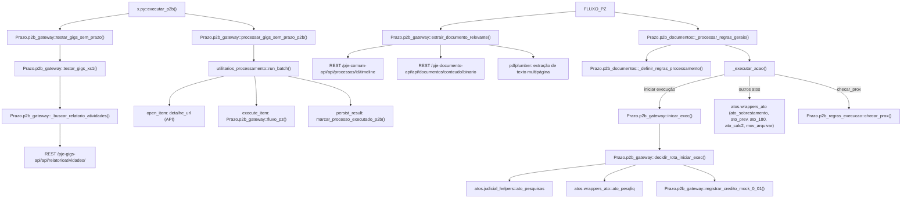
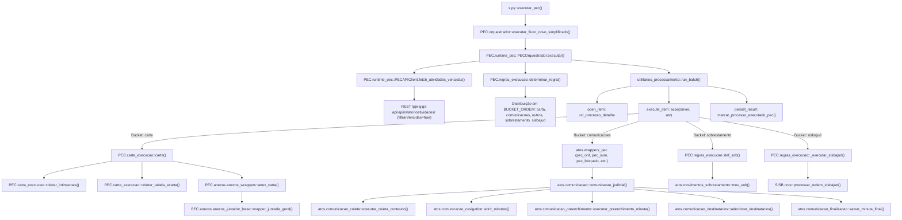

# Relatório Completo de Análise e Auditoria Estática (Fase A)
## Fluxos: Mandado, P2B e PEC (PJePlus — Branch `refactor/pw-nativo`)

**Status Inicial:** Branch `refactor/pw-nativo`, backend Playwright nativo ativo (`pjeplay`), 55/55 smoke tests WebDriver passando.  
**Escopo Estrito de Auditoria:**  
`pw.py` → `x.py::main()` → `x.py::FLOW_HANDLERS` → `Mandado`, `P2B`, `PEC`  

---

## 1. Orquestração Geral e Inicialização

O sistema é iniciado via `pw.py`, que atua como bootstrap de ambiente e injeta os handlers do backend Playwright antes da execução do orquestrador interativo `x.py`.

```
pw.py::main()
  ├─ pjeplay.iniciar(raiz_projeto, nativo=True)
  │    └─ compat.py + nativo.aplicar() [injeta implementações nativas em Fix.core]
  ├─ Fix.monitoramento_progresso_unificado::limpar_progresso_antigos(dias=2)
  └─ x.py::main()
       ├─ x.py::selecionar_ambiente_e_fluxo() [CLI / PJEPLUS_DRIVER / PJEPLUS_FLUXO]
       ├─ x.py::configurar_logging() [FileHandler + StreamHandler + erro.md]
       ├─ x.py::criar_e_logar_driver()
       │    ├─ [Headless] _criar_driver_headless_com_login_visivel()
       │    └─ [Visível] criar_driver_pc / criar_driver_vt + login_manual
       └─ loop while fluxo:
            ├─ x.py::_executar_um_fluxo(driver, fluxo)
            │    └─ FLOW_HANDLERS[fluxo](driver)
            │         ├─ 'B' -> executar_mandado(driver)
            │         ├─ 'D' -> executar_p2b(driver)
            │         ├─ 'E' -> executar_pec(driver)
            │         └─ 'A' -> executar_bloco_completo(driver) [B -> C/Prazo -> D -> E]
            └─ x.py::_resetar_para_painel(driver)
```

---

## 2. Grafos de Chamadas e Componentes por Fluxo

### 2.1. Fluxo A: Mandado

#### Grafo Detalhado de Chamadas



```mermaid
graph TD
    X_MANDADO["x.py::executar_mandado()"] --> PROC_MANDADOS["Mandado.entrada_api::processar_mandados_devolvidos_api()"]
    PROC_MANDADOS --> OBT_MANDADOS["Mandado.entrada_api::obter_mandados_devolvidos()"]
    OBT_MANDADOS --> API_CLIENT["api.variaveis_client::PjeApiClient"]
    OBT_MANDADOS --> API_PAG["Mandado.entrada_api::_buscar_todas_paginas_gateway()"]
    PROC_MANDADOS --> UI_FILTRO["Mandado.fluxo_ui::ativar_filtro_mandados_devolvidos()"]
    PROC_MANDADOS --> CLASS_API["Mandado.entrada_api::_classificar_tipo_timeline_api()"]
    
    CLASS_API -->|itens_argos_sigilo| BLOCO1["BLOCO 1: Argos / Sigilo"]
    CLASS_API -->|itens_certidao| BLOCO2["BLOCO 2: Certidão de Oficial"]
    CLASS_API -->|itens_outros| BLOCO3["BLOCO 3: O Resto (Batch)"]
    
    BLOCO1 --> FLUXO_ARGOS["Mandado.fluxo_argos::processar_argos()"]
    FLUXO_ARGOS --> FECHAR_INTIM["Mandado.entrada_api::fechar_intimacao()"]
    FLUXO_ARGOS --> SEQ_API["Mandado.apoio_fluxos::buscar_documentos_sequenciais_via_api()"]
    FLUXO_ARGOS --> SIGILO_ARGOS["Mandado.apoio_fluxos::retirar_sigilo_fluxo_argos()"]
    FLUXO_ARGOS --> TRATAR_ANEXOS["Mandado.anexos_argos::tratar_anexos_argos()"]
    TRATAR_ANEXOS --> ATOS_SIGILO["atos.anexos_sigilo::inserir_sigilo_individual + visibilidade_sigilosos_lote_apenas"]
    FLUXO_ARGOS --> SISB_ANEXOS["Mandado.anexos_argos::processar_sisbajud()"]
    FLUXO_ARGOS --> REGRAS_ARGOS["Mandado.regras::aplicar_regras_argos()"]
    REGRAS_ARGOS --> ATO_MEIOS["atos.wrappers_ato::ato_meios"]
    REGRAS_ARGOS --> ATO_PESQ["atos.judicial_helpers::ato_pesquisas"]
    REGRAS_ARGOS --> ATO_IDPJ["atos.wrappers_ato::ato_idpj / pec_idpj"]
    
    BLOCO2 --> SEL_DOC_TL["Mandado.entrada_api::_selecionar_doc_via_timeline()"]
    BLOCO2 --> CLAS_CAB["Mandado.entrada_api::_classificar_tipo_processo_cabecalho()"]
    BLOCO2 -->|CartPrecCiv| FLUXO_CP["Mandado.apoio_fluxos::fluxo_mandados_cp()"]
    BLOCO2 -->|Outros| FLUXO_OUTROS["Mandado.apoio_fluxos::fluxo_mandados_outros()"]
    FLUXO_OUTROS --> ARQ_RECONHECIDO["Mandado.apoio_fluxos::arquivar_mandado_outros_reconhecido"]
    FLUXO_OUTROS --> ARQ_POSITIVO["Mandado.apoio_fluxos::arquivar_mandado_positivo_reconhecido"]
    
    BLOCO3 --> BATCH_MANDADO["utilitarios_processamento::run_batch()"]
    BATCH_MANDADO --> DETALHE_MANDADO["Mandado.entrada_api::processar_mandado_detalhe()"]
```

#### Tabela de Componentes do Fluxo Mandado

| Arquivo | Função / Classe | Chamador | O que chama | Participa do Fluxo Real? | Efeitos Colaterais | Dependências Compartilhadas | Nível de Risco |
|---|---|---|---|---|---|---|---|
| `x.py` | `executar_mandado` | `FLOW_HANDLERS['B']` | `Mandado.entrada_api::processar_mandados_devolvidos_api` | SIM | Reseta abas pós-execução | `Fix.log`, `Fix.tipos` | Baixo |
| `Mandado/entrada_api.py` | `processar_mandados_devolvidos_api` | `x.py::executar_mandado` | `obter_mandados_devolvidos`, `ativar_filtro_mandados_devolvidos`, `processar_argos`, `fluxo_mandados_outros`, `run_batch` | SIM | Filtra escaninho no browser, orquestra 3 blocos | `utilitarios_processamento`, `Fix.core`, `Fix.variaveis` | Médio |
| `Mandado/entrada_api.py` | `obter_mandados_devolvidos` | `processar_mandados_devolvidos_api` | `_buscar_todas_paginas_gateway`, `_criar_api_client` | SIM | Consulta REST `/pje-comum-api/api/escaninhos/documentosinternos` | `api.variaveis_client` | Baixo |
| `Mandado/entrada_api.py` | `fechar_intimacao` | `fluxo_argos::processar_argos` | DOM PJe: `#botao-menu`, `button[aria-label="Expedientes"]`, modal de expedientes, checkbox prazo 30, `button[aria-label="Fechar Expedientes"]` | SIM | Fecha intimação no PJe, dispara transição de tarefa | `Fix.core`, `Fix.espera` | Alto (interação modal crítica) |
| `Mandado/fluxo_ui.py` | `ativar_filtro_mandados_devolvidos` | `processar_mandados_devolvidos_api` | DOM: filtros do escaninho (`pje-escaninho-filtro-documentos`) | SIM | Aplica filtro de UI no escaninho | `Fix.core`, `Fix.espera` | Baixo |
| `Mandado/fluxo_argos.py` | `processar_argos` | `processar_mandados_devolvidos_api` | `fechar_intimacao`, `buscar_documentos_sequenciais_via_api`, `retirar_sigilo_fluxo_argos`, `tratar_anexos_argos`, `processar_sisbajud`, `aplicar_regras_argos` | SIM | Executa atos judiciais, remove sigilos, altera status | `Fix.extracao`, `atos`, `PEC.core_progresso` | Alto |
| `Mandado/anexos_argos.py` | `tratar_anexos_argos` | `processar_argos` | `atos.anexos_sigilo::inserir_sigilo_individual`, `visibilidade_sigilosos_lote_apenas` | SIM | Aplica sigilo em anexos IRPF/DOI e visibilidade ao polo ativo | `atos.anexos_sigilo`, `Fix.espera` | Médio |
| `Mandado/anexos_argos.py` | `processar_sisbajud` | `processar_argos` | Lógica pura regex/texto sobre certidão de devolução | SIM | Nulo (função pura de classificação) | `re`, `unicodedata` | Baixo |
| `Mandado/regras.py` | `aplicar_regras_argos` | `processar_argos` | `estrategia_*` -> `ato_meios`, `ato_pesquisas`, `ato_idpj`, `pec_idpj` | SIM | Confecciona minutas e atos no PJe | `atos`, `Fix.core`, `core.rule_registry` | Alto |
| `Mandado/apoio_fluxos.py` | `fluxo_mandados_outros` | `processar_mandados_devolvidos_api` | `_classificar_certidao_oficial`, `_executar_acoes_padrao_negativo` | SIM | Determina se positivo/negativo | `Fix.core`, `Fix.extracao` | Médio |
| `Mandado/apoio_fluxos.py` | `fluxo_mandados_cp` | `processar_mandados_devolvidos_api` | `baixarCP`, `mov_arquivar`, `ato_judicial` | SIM | Baixa carta precatória, arquiva processo | `Fix.core`, `atos` | Alto |

---

### 2.2. Fluxo B: P2B (GIGS Sem Prazo / XS1)

#### Grafo Detalhado de Chamadas



#### Tabela de Componentes do Fluxo P2B

| Arquivo | Função / Classe | Chamador | O que chama | Participa do Fluxo Real? | Efeitos Colaterais | Dependências Compartilhadas | Nível de Risco |
|---|---|---|---|---|---|---|---|
| `x.py` | `executar_p2b` | `FLOW_HANDLERS['D']` / `executar_prazo` / `executar_bloco_completo` | `testar_gigs_sem_prazo`, `processar_gigs_sem_prazo_p2b` | SIM | Reseta driver se erro 401 | `Prazo.p2b_gateway`, `Fix.log` | Baixo |
| `Prazo/p2b_gateway.py` | `processar_gigs_sem_prazo_p2b` | `x.py::executar_p2b` | `testar_gigs_xs1`, `run_batch` (`open_item`, `execute_item=fluxo_pz`, `persist_result`) | SIM | Navega abas, registra progresso | `utilitarios_processamento`, `Fix.core` | Médio |
| `Prazo/p2b_gateway.py` | `testar_gigs_xs1` | `processar_gigs_sem_prazo_p2b` | `_buscar_relatorio_atividades` | SIM | Consulta API GIGS | `api.variaveis_client` | Baixo |
| `Prazo/p2b_gateway.py` | `extrair_documento_relevante` | `fluxo_pz` | `client.timeline`, `/conteudo/binario`, `pdfplumber` | SIM | Download binário de peças, parse em memória | `pdfplumber`, `Fix.variaveis` | Médio |
| `Prazo/p2b_gateway.py` | `fluxo_pz` | `processar_gigs_sem_prazo_p2b` (batch) | `extrair_documento_relevante`, `normalizar_texto`, `_processar_regras_gerais`, `_fechar_aba_processo` | SIM | Executa atos judiciais do processo | `Prazo.p2b_documentos`, `Fix.utils` | Alto |
| `Prazo/p2b_gateway.py` | `inicar_exec` | `_processar_regras_gerais` (via regra casada) | `decidir_rota_iniciar_exec`, `criar_gigs`, `registrar_credito_mock_0_01`, `ato_pesquisas`, `ato_pesqliq` | SIM | Cria GIGS, registra crédito mock no PJeKZ, abre tarefa, minuta pesquisas | `Fix.core`, `atos.judicial_helpers`, `atos.wrappers_ato` | Alto |
| `Prazo/p2b_documentos.py` | `_processar_regras_gerais` | `fluxo_pz` | `_definir_regras_processamento`, `gerar_regex_geral`, `_executar_acao` | SIM | Varredura de regex e disparo de ações | `Prazo.p2b_regras_execucao`, `Fix.espera` | Alto |
| `Prazo/p2b_regras_execucao.py` | `checar_prox` | `_processar_regras_gerais` | Analisa documentos anteriores na timeline | SIM | Navega timeline para decidir se ato anterior impede novo ato | `Fix.espera`, `Fix.core` | Médio |
| `Prazo/p2b_regras_execucao.py` | `marcar_processo_executado_p2b` | `persist_result` | Grava checkpoint no `progresso.json` | SIM | I/O em disco de progresso | `Fix.monitoramento_progresso_unificado` | Baixo |

---

### 2.3. Fluxo C: PEC

#### Grafo Detalhado de Chamadas



#### Tabela de Componentes do Fluxo PEC

| Arquivo | Função / Classe | Chamador | O que chama | Participa do Fluxo Real? | Efeitos Colaterais | Dependências Compartilhadas | Nível de Risco |
|---|---|---|---|---|---|---|---|
| `x.py` | `executar_pec` | `FLOW_HANDLERS['E']` / `executar_bloco_completo` | `PEC.orquestrador::executar_fluxo_novo_simplificado` | SIM | Trata erro crítico e reset de driver | `PEC.orquestrador`, `Fix.log` | Baixo |
| `PEC/orquestrador.py` | `executar_fluxo_novo_simplificado` | `x.py::executar_pec` | `PEC.runtime_pec::PECOrquestrador.executar` | SIM (Shim) | Nulo (re-export) | `PEC.runtime_pec` | Mínimo |
| `PEC/runtime_pec.py` | `PECOrquestrador.executar` | `executar_fluxo_novo_simplificado` | `PECAPIClient.fetch_atividades_vencidas`, `determinar_regra`, `run_batch` | SIM | Orquestra execução de todo o lote PEC | `utilitarios_processamento`, `PEC.regras_execucao` | Alto |
| `PEC/runtime_pec.py` | `PECAPIClient.fetch_atividades_vencidas` | `PECOrquestrador.executar` | `api.buscar_todas_paginas` | SIM | Consulta REST GIGS vencidas | `api.variaveis_client` | Baixo |
| `PEC/regras_execucao.py` | `determinar_regra` | `PECOrquestrador.executar` | `RuleRegistry.match` | SIM | Classifica observação GIGS em bucket + ação executável | `core.rule_registry` | Médio |
| `PEC/carta_execucao.py` | `carta` | `PECOrquestrador.executar` (bucket carta) | `coletar_intimacoes`, `coletar_tabela_ecarta`, `anex_carta` | SIM | Coleta ARs dos Correios, monta HTML, anexa petição | `PEC.anexos.anexos_wrappers`, `Fix.core` | Alto |
| `atos/comunicacao.py` | `comunicacao_judicial` | Wrappers de `atos.wrappers_pec` | `executar_coleta_conteudo`, `abrir_minutas`, `executar_preenchimento_minuta`, `selecionar_destinatarios`, `salvar_minuta_final` | SIM | Confecciona notificações e comunicações PEC | `atos.comunicacao_*` | Alto |
| `atos/comunicacao_preenchimento.py` | `executar_preenchimento_minuta` | `comunicacao_judicial` | `escolher_opcao_select_js`, `clicar_radio_button_js`, `preencher_input_js`, `inserir_modelo_no_editor` | SIM | Preenche modal Angular Material de minuta | `Fix.core`, `Fix.espera` | Alto |
| `atos/comunicacao_destinatarios.py` | `selecionar_destinatarios` | `comunicacao_judicial` | DOM de destinatários polo passivo/ativo | SIM | Seleciona réus/autores para expedição | `Fix.core`, `Fix.espera` | Alto |
| `atos/comunicacao_finalizacao.py` | `salvar_minuta_final` | `comunicacao_judicial` | DOM: botão Salvar, assinar, visibilidade | SIM | Persiste minuta no PJe | `Fix.core`, `Fix.espera` | Alto |

---

## 3. Inventário Exaustivo de Código Morto e Stubs

> **Critério de Comprovação Rigorosa:** Verificado via análise AST, ausência total de chamadas estáticas/dinâmicas em todo o repositório (excluindo pastas descontinuadas `leg/` e `_archive/`), ausência de referências em registries, strings e CLI.

| Arquivo | Símbolo | Tipo | Evidência de Ausência | Impacto da Remoção |
|---|---|---|---|---|
| `Mandado/entrada_api.py` | `_gigs_sem_prazo_via_js` | Função | Zero chamadas no módulo; zero chamadas externas em todo o projeto | Elimina 35 linhas de código morto |
| `Mandado/entrada_api.py` | `testar_api_gigs_sem_prazo` | Função | Zero chamadas no módulo; zero chamadas externas em todo o projeto | Elimina 8 linhas de stub |
| `Mandado/entrada_api.py` | `retirar_sigilo_documentos_especificos` | Função | Não chamada internamente; re-exportada em `Mandado/__init__.py` a partir de `apoio_fluxos` | Elimina 54 linhas de duplicação desatualizada |
| `Mandado/entrada_api.py` | `retirar_sigilo_demais_documentos_especificos` | Função | Não chamada internamente; re-exportada em `Mandado/__init__.py` a partir de `apoio_fluxos` | Elimina 5 linhas de stub |
| `Mandado/anexos_argos.py` | `_localizar_modal_visibilidade` | Função | Função local privada (prefixada `_`); zero chamadas em `anexos_argos.py` (substituída por `atos.anexos_sigilo`) | Elimina 18 linhas |
| `Mandado/anexos_argos.py` | `_processar_modal_visibilidade` | Função | Função local privada (prefixada `_`); zero chamadas em `anexos_argos.py` | Elimina 46 linhas de código obsoleto |
| `Mandado/regras.py` | `_lazy_import_mandado_regras` | Função + Cache | Definida em L42-73; zero chamadas em `regras.py` e em todo o projeto | Elimina 34 linhas de complexidade desnecessária |
| `Prazo/p2b_gateway.py` | `gerar_script_gigs_xs1` | Função stub | Retorna string `// Deprecated...`; zero chamadas no pipeline real | Elimina 4 linhas |
| `Prazo/p2b_gateway.py` | `gerar_script_gigs_sem_prazo` | Função stub | Wrapper de função deprecated; zero chamadas | Elimina 3 linhas |
| `atos/judicial_helpers.py` | `preencher_prazos_destinatarios` | Função | Versão divergente não utilizada por nenhum fluxo ativo (`atos/judicial_fluxo.py` usa `atos.judicial_utils`) | Elimina 10 linhas |
| `atos/judicial_helpers.py` | `verificar_bloqueio_recente` | Função | Versão divergente não utilizada por nenhum fluxo ativo (`judicial_fluxo` usa `judicial_utils`) | Elimina 30 linhas |
| `Mandado/entrada_api.py` + `Mandado/regras.py` | Top-level `open("log.py", "w")` | Efeito colateral | Resíduo de script standalone que sobrescreve arquivo raiz no import | Elimina risco de race condition em disco |

---

## 4. Diagnóstico de Duplicações Estruturais

1. **Dynamic Client Loader (`_api_core_types` / `_criar_api_client`):**
   - Ocorrências: `Mandado/entrada_api.py`, `Mandado/apoio_fluxos.py`, `Prazo/p2b_gateway.py`.
   - Problema: 3 cópias idênticas carregando `api/variaveis_client.py` dinamicamente via `importlib.util`.
   - Solução: Centralização no cliente unificado `Fix.variaveis::PjeApiClient`.

2. **Sub-elemento Helper (`_sub_elemento(el, seletor)`):**
   - Ocorrências: `PEC/regras_execucao.py`, `PEC/carta_execucao.py`.
   - Problema: Código de 15 linhas tratando query_selector vs find_element duplicado entre módulos.
   - Solução: Consolidar em `Fix.browser_suporte`.

3. **Extração de Texto de PDF (`pdfplumber` loop):**
   - Ocorrências: `Mandado/apoio_fluxos.py`, `Prazo/p2b_gateway.py`, `PEC/carta_execucao.py`.
   - Problema: 3 implementações idênticas abrindo `pdfplumber.open(io.BytesIO(bytes))` e concatenando páginas.
   - Solução: Unificar em `Fix.extracao::extrair_pdf_bytes(pdf_bytes)`.

4. **Fallbacks de Preenchimento de Prazo e Seletores de Minuta:**
   - Ocorrências: `atos/comunicacao_preenchimento.py`, `atos/judicial_utils.py`.
   - Problema: Listas locais de CSS/XPath para inputs de prazo testadas em loops imperativos repetidos a cada ato.
   - Solução: Centralizar na Ação Semântica `comunicacao_input_prazo` do catálogo de seletores.

---

## 5. Mapa de Seletores e Cadeias de Fallbacks

| Ação Semântica | Contexto / Tela | Seletor Principal | Fallbacks Controlados | Timeout Acumulado | Diagnóstico de Fragilidade |
|---|---|---|---|---|---|
| `abrir_tarefa_processo` | Detalhe do Processo (KZ) | `button[mattooltip="Abre a tarefa do processo"]` | 1. `button[mattooltip*='tarefa']`<br>2. `button[aria-label*='tarefa']`<br>3. `button[title*='tarefa']` | Até 18s | Repetido em múltiplos arquivos com listas divergentes. |
| `fechar_intimacao_menu` | Processo / Timeline | `#botao-menu` | Nenhum (ID direto) | 2s | Estável e rápido. |
| `fechar_intimacao_expedientes` | Menu Lateral | `button[aria-label="Expedientes"]` | Nenhum | 3s | Estável. |
| `fechar_intimacao_checkbox` | Modal Expedientes | `mat-checkbox input[type="checkbox"]` | 1. `mat-checkbox` direto<br>2. `safe_click_no_scroll(input)` | ~4s | Tentava 4 métodos no mesmo elemento em loop manual. |
| `fechar_intimacao_confirmar` | Modal de Confirmação | `//mat-dialog-container//button[normalize-space(.)='Sim']` | `//div[contains(@class,'cdk-overlay-pane')]//button[normalize-space(.)='Sim']` | 2s | XPath seguro. |
| `abrir_minutas_comunicacao` | Detalhe da Tarefa | `pje-botoes-transicao button[aria-label="Minutar"]` | 1. `button[aria-label="Minutar"]`<br>2. `button[mattooltip*="Minutar"]` | 5s | Disperso em `atos/comunicacao_navigation.py`. |
| `selecionar_tipo_expediente` | Modal de Minuta | `mat-select[placeholder="Tipo de Expediente"]` | 1. `mat-select[formcontrolname="tipoExpediente"]`<br>2. `pje-tipo-expediente mat-select` | 10s | Clica no select, aguarda overlay CDK, varre `mat-option`. |
| `preencher_prazo_comunicacao` | Modal de Minuta | `input[aria-label="Prazo em dias úteis"]` | 1. `input[placeholder*="dias úteis"]`<br>2. `mat-form-field input[type="number"]` | 10s | Loop local iterando sobre 4 seletores. |
| `marcar_sigilo_minuta` | Modal de Minuta | `input[name="sigiloso"]` | 1. `mat-checkbox[formcontrolname="sigiloso"]`<br>2. Fallback JS via evaluate | 7s | Tenta `mat_checkbox`, depois JS `querySelector.click()`. |
| `salvar_minuta_final` | Modal / Editor | `button[aria-label="Salvar"], button[aria-label="Gravar"]` | 1. `//button[contains(., 'Salvar')]`<br>2. `button.btn-primary` | 10s | Múltiplas tentativas de clique cego. |

---

## 6. Inventário de Logs e Diagnóstico de Ruído

### 6.1. Estatísticas Quantitativas no Escopo dos Três Fluxos

- **`logger.error`**: 298 ocorrências
- **`logger.warning`**: 188 ocorrências
- **`logger.info`**: 682 ocorrências
- **`logger.debug`**: 51 ocorrências
- **`logger.exception`**: 1 ocorrência
- **`print(...)` direto**: 65 ocorrências (concentradas em `PEC/anexos/anexos_juntador_helpers.py` e `anexos_juntador_metodos.py`)

### 6.2. Patologias de Observabilidade Diagnosticadas

1. **`print(...)` soltos em produção:**  
   65 instruções emitindo strings como `[JUNTADA][DEBUG] Abrindo interface de anexação...` poluindo stdout em lote.
2. **Clobbering de Logging Configuration em `PEC/regras_execucao.py`:**  
   Linhas 44-54 invocando `logging.basicConfig(..., force=True)`, resetando o root logger configurado pelo `x.py` e duplicando a saída no console.
3. **Logs repetitivos por processo em loops normais:**  
   Mensagens de passo a passo de clique (Passo 1, Passo 2, Passo 3) emitidas em `INFO` em vez de `DEBUG`.
4. **Vazamento potencial de dados pessoais em logs de exceção:**  
   CPFs, CNPJs e tokens de sessão interpolados em strings brutas de erro sem sanitização.

---

## 7. Diagnóstico de Concorrência, Abas e Acoplamento

1. **Gestão de Abas:**  
   Os fluxos operam com múltiplas abas (`pje-painel`, `detalhe-processo`, `editor-ato`). O controle de fechamento em `Prazo/p2b_gateway.py` (`_fechar_aba_processo`) e `Mandado/entrada_api.py` dependia de iteração em `driver.window_handles` reversa, agora suportada nativamente pelo Playwright via `Page.close()` e verificação de contexto.
2. **Acoplamento entre Regra Jurídica e DOM:**  
   Em `Mandado/regras.py`, a decisão jurídica (qual ato praticar com base nos termos da certidão) estava embutida dentro de funções que executavam cliques na interface (`estrategia_argos_despacho_generico`).
   - *Correção necessária:* Desacoplar a decisão pura (`decidir_ato_despacho_argos`) da execução do ato no DOM (`_executar_ato_seguro`).

---
*Fim do Relatório de Análise e Auditoria Estática (Fase A).*
