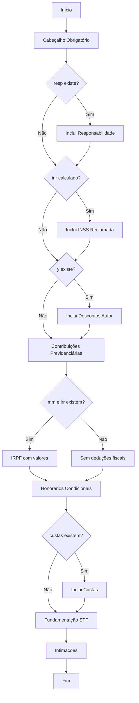

# HOMOL.MD - Estrutura da Decisão de Homologação de Cálculos

## 📋 VISÃO GERAL

Este documento explica detalhadamente a estrutura da decisão de homologação de cálculos gerada automaticamente pelo script CALC.user.js, incluindo todas as variáveis utilizadas, condicionais e trechos que são incluídos ou omitidos dependendo dos dados extraídos.

---

## 🏗️ ESTRUTURA COMPLETA DA DECISÃO

### **1. CABEÇALHO OBRIGATÓRIO** *(Condicional baseado na variável rog - PROBLEMA ATUAL)*

⚠️ **PROBLEMA IDENTIFICADO:** A lógica de detecção do cabeçalho está incorreta:

**Lógica Atual (PROBLEMÁTICA):**
```javascript
if (dadosExtraidos.planilha.rog) {
    // Cabeçalho para planilhas assinadas por perito (INCORRETO - usa qualquer perito)
} else {
    // Cabeçalho padrão (sem perito)
}
```

**PROBLEMAS ATUAIS:**
1. **Critério incorreto**: Usa `rog` (qualquer perito) em vez de `isRogerio` (especificamente ROGERIO)
2. **Detecção falsa**: Pode escolher cabeçalho de perito para outros peritos que não são ROGERIO
3. **Inconsistência**: A flag `isRogerio` existe mas não é usada para escolher o cabeçalho

**CORREÇÃO NECESSÁRIA:**
```javascript
if (dadosExtraidos.planilha.isRogerio) {
    // Cabeçalho específico para ROGERIO APARECIDO ROSA
} else {
    // Cabeçalho padrão para todos os outros casos
}
```

**Condições Corretas:**
- **Se `isRogerio = false` (ROGERIO NÃO detectado):** Usa cabeçalho padrão com "concordância das partes" 
- **Se `isRogerio = true` (ROGERIO especificamente detectado):** Usa cabeçalho específico com texto sobre impugnações

**Variáveis utilizadas:**
- `rog` = Assinatura eletrônica de ROGERIO APARECIDO ROSA (extraída automaticamente)
- `idd` = ID da planilha (extraído automaticamente)
- `total` = Total bruto devido ao reclamante (extraído automaticamente)
- `data` = Data de liquidação (extraída automaticamente)

**Fallback:** Se alguma variável não for encontrada, será exibida como `[VARIÁVEL NÃO ENCONTRADA]`

---

### **2. RESPONSABILIDADE DAS RECLAMADAS** *(Condicional)*
```javascript
if (dadosExtraidos.sentenca.resp) {
    decisao += `As reclamadas são devedoras ${dadosExtraidos.sentenca.resp}.`;
}
```

**Possíveis valores:**
- **Se `resp = 'solidárias'`:** "As reclamadas são devedoras solidárias."
- **Se `resp = 'subsidiárias'`:** "As reclamadas são devedoras subsidiárias."
- **Se `resp = null`:** *(Trecho omitido)*

**Origem:** Extraído da sentença (busca por "solidária" ou "subsidiária")

---

### **3. INSS DA RECLAMADA** *(Condicional)*
```javascript
if (dadosExtraidos.planilha.inr && dadosExtraidos.planilha.inr !== '[INSS NÃO ENCONTRADO]') {
    decisao += `A reclamada, ainda, deverá pagar o valor de sua cota parte no INSS, a saber, R$ ${dadosExtraidos.planilha.inr}, para ${data}.`;
}
```

**Condição:** Só aparece se `inr` (INSS da Reclamada) foi calculado com sucesso
**Cálculo:** `inr = x - y` onde:
- `x` = INSS Bruto da Reclamada (extraído de "Contribuição Social sobre Salários Devidos")
- `y` = INSS do Autor (extraído de "DEDUÇÃO DE CONTRIBUIÇÃO SOCIAL")

**Exemplo:** "A reclamada, ainda, deverá pagar o valor de sua cota parte no INSS, a saber, R$ 1.234,56, para 15/06/2025."

---

### **4. DESCONTOS PREVIDENCIÁRIOS DO AUTOR** *(Condicional)*
```javascript
if (dadosExtraidos.planilha.y) {
    decisao += `Desde já, ficam autorizados os descontos previdenciários (cota do reclamante) ora fixados em R$ ${dadosExtraidos.planilha.y}, para ${data}.`;
}
```

**Condição:** Só aparece se `y` (INSS do Autor) foi extraído
**Origem:** Extraído de "DEDUÇÃO DE CONTRIBUIÇÃO SOCIAL" na planilha

---

### **5. CONTRIBUIÇÕES PREVIDENCIÁRIAS** *(Condicional - PROBLEMA ATUAL)*

⚠️ **PROBLEMA IDENTIFICADO:** O código atual tem lógica incorreta para detectar INSS:

```javascript
const temINSSAutor = dadosExtraidos.planilha.y;
const temINSSReclamada = dadosExtraidos.planilha.inr && dadosExtraidos.planilha.inr !== '[INSS NÃO ENCONTRADO]';

if (temINSSAutor || temINSSReclamada) {
    // Inclui o trecho de contribuições previdenciárias (INCORRETO)
} else {
    // Deveria incluir "Não há débitos ou descontos previdenciários" (MAS NÃO FAZ)
}
```

**PROBLEMAS ATUAIS:**
1. **Detecção de INSS incorreta**: Está identificando INSS onde não há
2. **Falta da regra negativa**: Quando NÃO há INSS, deveria incluir "Não há débitos ou descontos previdenciários"
3. **Lógica invertida**: Está incluindo trecho complexo quando deveria incluir frase simples

**CORREÇÃO NECESSÁRIA:**
```javascript
const temINSSAutor = dadosExtraidos.planilha.y;
const temINSSReclamada = dadosExtraidos.planilha.inr && dadosExtraidos.planilha.inr !== '[INSS NÃO ENCONTRADO]';

if (temINSSAutor || temINSSReclamada) {
    // Inclui trecho complexo de contribuições previdenciárias
    decisao += `Os valores relativos às contribuições previdenciárias...`;
    decisao += `Nos casos em que os recolhimentos forem efetuados...`;
} else {
    // Inclui frase simples quando NÃO HÁ INSS
    decisao += `Não há débitos ou descontos previdenciários.\n\n`;
}
```
```javascript
const temINSSAutor = dadosExtraidos.planilha.y;
const temINSSReclamada = dadosExtraidos.planilha.inr && dadosExtraidos.planilha.inr !== '[INSS NÃO ENCONTRADO]';

if (temINSSAutor || temINSSReclamada) {
    decisao += `Os valores relativos às contribuições previdenciárias...`;
    decisao += `Nos casos em que os recolhimentos forem efetuados...`;
} else {
    // Trecho completamente omitido
}
```

**Nova Lógica de Inclusão:**
- ✅ **Inclui** se encontrou pelo menos uma variável de INSS:
  - `y` (INSS do Autor) OU
  - `inr` (INSS da Reclamada calculado)
- ❌ **Exclui completamente** se NÃO encontrou nenhuma variável de INSS

**Condições de Extração das Variáveis INSS:**
1. **INSS do Autor (`y`):** Extraído de "DEDUÇÃO DE CONTRIBUIÇÃO SOCIAL" 
2. **INSS da Reclamada (`inr`):** Calculado a partir de "Contribuição Social sobre Salários Devidos" - INSS do Autor

**Cenários:**
- **Caso 1:** Encontrou ambos os campos → Inclui o trecho
- **Caso 2:** Encontrou apenas INSS do Autor → Inclui o trecho  
- **Caso 3:** Encontrou apenas INSS da Reclamada → Inclui o trecho
- **Caso 4:** NÃO encontrou nenhum campo de INSS → **EXCLUI o trecho completamente**

**Texto Completo:**
```
Os valores relativos às contribuições previdenciárias devidas em decorrência de decisões proferidas pela Justiça do Trabalho a partir de 1º de outubro de 2023, inclusive acordos homologados, devem ser recolhidos pelo(a) reclamado(a) por meio da DCTFWeb, depois de serem informados os dados da reclamatória trabalhista no eSocial. Atente que os registros no eSocial serão feitos por meio dos eventos: "S-2500 - Processos Trabalhistas" e "S-2501- Informações de Tributos Decorrentes de Processo Trabalhista".

Nos casos em que os recolhimentos forem efetuados diretamente pela Justiça do Trabalho, o reclamado deverá enviar através do eSocial somente o evento "S-2500 – Processos Trabalhistas".
```

---

### **6. IMPOSTO DE RENDA (IRPF)** *(Condicional Baseada em IRPF DEVIDO)*

**Nova Lógica:** A decisão agora usa **APENAS** a variável `irpf` (IRPF DEVIDO PELO RECLAMANTE) para determinar qual regra aplicar.

#### **Opção A - Regra Geral** *(Quando irpf = 0,00 ou não encontrado)*
```javascript
if (!irpfDevido || irpfDevido === '0,00' || parseFloat(irpfDevido.replace(',', '.')) === 0) {
    decisao += `Não há deduções fiscais cabíveis.`;
}
```

#### **Opção B - Regra Específica** *(Quando irpf ≠ 0,00)*
```javascript
else {
    const baseIRPF = dadosExtraidos.planilha.irr || '[BASE IRPF NÃO ENCONTRADA]';
    const mesesIRPF = dadosExtraidos.planilha.mm || '[MESES NÃO ENCONTRADOS]';
    decisao += `Ficam autorizados os descontos fiscais, calculados sobre as verbas tributáveis (R$ ${baseIRPF}), pelo período de ${mesesIRPF} meses.`;
}
```

**Variável Determinante:**
- `irpf` = IRPF DEVIDO PELO RECLAMANTE (extraído da planilha)

**Variáveis Auxiliares (apenas na Opção B):**
- `irr` = Base de cálculo do IRPF (verbas tributáveis)
- `mm` = Quantidade de meses para IRPF

**Padrão de Extração:**
- `irpf`: "IRPF DEVIDO PELO RECLAMANTE: [valor]"
- `irr`: Tabela "Demonstrativo de Imposto de Renda"
- `mm`: Tabela "Demonstrativo de Imposto de Renda"

**Cenários:**
- **Caso 1:** `irpf = 0,00` → **Opção A** ("Não há deduções fiscais cabíveis")
- **Caso 2:** `irpf = 1.234,56` → **Opção B** (com valores de `irr` e `mm`)
- **Caso 3:** `irpf` não encontrado → **Opção A** (regra geral)

**Importante:** A decisão sempre conterá **APENAS UMA** das duas opções, nunca ambas simultaneamente.

---

### **7. HONORÁRIOS PERICIAIS** *(Condicionais Independentes)*

#### **7.1. Honorários por Requisição ao TRT**
```javascript
if (dadosExtraidos.sentenca.HPS) {
    decisao += `${dadosExtraidos.sentenca.HPS}`;
}
```
**Exemplo:** "Honorários periciais por requisição ao TRT, valor de R$ 500,00, já solicitados/pagos"

#### **7.2. Honorários Periciais Técnicos**
```javascript
if (dadosExtraidos.sentenca.hp1) {
    decisao += `${dadosExtraidos.sentenca.hp1}`;
}
```
**Exemplo:** "Honorários periciais técnicos no valor de R$ 1.000,00"

#### **7.3. Honorários Periciais Contábeis (Rogério)**
```javascript
if (dadosExtraidos.planilha.rog) {
    decisao += `${dadosExtraidos.planilha.rog}`;
}
```
**Condição:** Só aparece se o documento foi assinado especificamente por "ROGERIO APARECIDO ROSA"
**Texto:** "honorários periciais contábeis"

---

### **8. HONORÁRIOS ADVOCATÍCIOS** *(Condicional)*
```javascript
if (dadosExtraidos.planilha.hav) {
    decisao += `Honorários advocatícios sucumbenciais pela reclamada, no importe de R$ ${dadosExtraidos.planilha.hav}, para ${data}.`;
}
```

**Origem:** 
1. **Primário:** Extraído de "HONORÁRIOS LÍQUIDOS PARA PATRONO DO RECLAMANTE"
2. **Fallback:** Calculado como 10% do total bruto se não encontrado

---

### **9. CUSTAS PROCESSUAIS** *(Condicional Complexa - PROBLEMA ATUAL)*

⚠️ **PROBLEMA IDENTIFICADO:** As custas não estão sendo incluídas na decisão:

**Problemas Atuais:**
1. **Extração falha**: Regex de custas não está capturando valores
2. **Validação excessiva**: Condição `custas.trim() && custas.trim() !== ','` pode estar bloqueando
3. **Debug insuficiente**: Logs não mostram onde a extração está falhando

**Lógica Atual (PROBLEMÁTICA):**
```javascript
const custas = dadosExtraidos.acordao.custasAc || dadosExtraidos.sentenca.custas;
const dataCustas = dadosExtraidos.sentenca.ds || data;

if (custas && custas.trim() && custas.trim() !== ',') {
    // Inclui linha de custas (MAS NÃO ESTÁ FUNCIONANDO)
} else {
    // Omite custas silenciosamente (PROBLEMA)
}
```

**CORREÇÃO NECESSÁRIA:**
1. **Melhorar regex** de extração de custas na sentença e acórdão
2. **Adicionar debug** detalhado para identificar onde a extração falha
3. **Simplificar validação** de valores de custas
4. **Testar padrões** específicos do TRT2

---

### **10. FUNDAMENTAÇÃO STF** *(Sempre presente)*
```
Ante os termos da decisão proferida pelo E. STF na ADI 5766, e considerando o deferimento dos benefícios da justiça gratuita ao autor, é indevido o pagamento de honorários sucumbenciais pelo trabalhador ao advogado da parte reclamada.
```

---

### **11. INTIMAÇÕES** *(Sempre presente)*
```
Intimações:

Intime-se a reclamada, na pessoa de seu patrono, para que pague os valores acima indicados em 15 dias, na forma do art. 523, caput, do CPC, sob pena de penhora.

Intime-se a reclamada para pagamento dos valores acima, em 48 (quarenta a oito) horas, sob pena de penhora, expedindo-se o competente mandado.

Ficam as partes cientes de que qualquer questionamento acerca desta decisão, salvo erro material, será apreciado após a garantia do juízo.
```

---

## 📊 VARIÁVEIS E SUAS ORIGENS

### **Variáveis Obrigatórias** *(Sempre usadas - PROBLEMAS ATUAIS)*

⚠️ **PROBLEMAS IDENTIFICADOS NA EXTRAÇÃO:**

| Variável | Origem | Padrão de Extração | Problema Atual | Correção Necessária |
|----------|--------|-------------------|----------------|---------------------|
| `idd` | Planilha | `às HH:MM:SS - [ID]` | **Extração incorreta** - pegando IDs aleatórios | Buscar especificamente na linha da assinatura |
| `total` | Planilha | "Bruto Devido ao Reclamante" | **Pode estar correto** | Verificar padrões de regex |
| `data` | Planilha | "Data Liquidação:" | **Extração incorreta** - pegando datas erradas | Priorizar "Data Liquidação" específica |

**DETALHES DOS PROBLEMAS:**

1. **ID da Planilha (`idd`)**: 
   - **Problema**: Fallback está pegando qualquer sequência de 6-15 caracteres
   - **Solução**: Extrair APENAS da mesma linha da assinatura eletrônica

2. **Data de Liquidação (`data`)**:
   - **Problema**: Fallback está pegando a última data encontrada
   - **Solução**: Priorizar "Data Liquidação:" específica, não qualquer data

3. **INSS do Autor (`y`)**:
   - **Problema**: Está detectando INSS onde não há
   - **Solução**: Melhorar regex e validação de valores

### **Variáveis Condicionais** *(Podem estar vazias)*
| Variável | Origem | Condição de Uso | Efeito se Ausente |
|----------|--------|-----------------|-------------------|
| `inr` | Calculado | `x` e `y` disponíveis | Trecho INSS Reclamada omitido |
| `y` | Planilha | "DEDUÇÃO DE CONTRIBUIÇÃO SOCIAL" | Trecho descontos autor omitido |
| `hav` | Planilha | "HONORÁRIOS LÍQUIDOS..." | Calcula 10% do total |
| `resp` | Sentença | "solidária" ou "subsidiária" | Trecho responsabilidade omitido |
| `irpf` | Planilha | "IRPF DEVIDO PELO RECLAMANTE" | **Determina regra A ou B** |
| `mm`/`irr` | Planilha | Demonstrativo IRPF | Usado apenas na Opção B |
| `rog` | Planilha | Assinatura ROGERIO APARECIDO ROSA | Trecho hon. contábeis omitido |

---

## ⚙️ FLUXO DE DECISÃO



---

## 🔍 EXEMPLOS DE DECISÕES

### **Exemplo 1: Decisão Completa** *(Todos os dados disponíveis)*
```
Tendo em vista a concordância das partes, HOMOLOGO os cálculos do autor/da reclamada (Id A1B2C3D4), fixando o crédito em R$ 50.000,00, referente ao valor principal, para 15/06/2025, atualizado pelo IPCA-E na fase pré-judicial e, a partir do ajuizamento da ação, pela taxa SELIC (art. 406 do Código Civil), conforme decisão do E. Supremo Tribunal Federal nas ADCs 58 e 59 e ADI 5867, de 18/12/2020.

As reclamadas são devedoras solidárias.

A reclamada, ainda, deverá pagar o valor de sua cota parte no INSS, a saber, R$ 3.500,00, para 15/06/2025.

Desde já, ficam autorizados os descontos previdenciários (cota do reclamante) ora fixados em R$ 1.500,00, para 15/06/2025.

[...demais trechos...]
```

### **Exemplo 2: Decisão Mínima** *(Apenas dados obrigatórios)*
```
Tendo em vista a concordância das partes, HOMOLOGO os cálculos do autor/da reclamada (Id A1B2C3D4), fixando o crédito em R$ 50.000,00, referente ao valor principal, para 15/06/2025, atualizado pelo IPCA-E na fase pré-judicial e, a partir do ajuizamento da ação, pela taxa SELIC (art. 406 do Código Civil), conforme decisão do E. Supremo Tribunal Federal nas ADCs 58 e 59 e ADI 5867, de 18/12/2020.

[Pula direto para contribuições previdenciárias...]

Não há deduções fiscais cabíveis.

[Continua com fundamentação e intimações...]
```

---

## 📝 OBSERVAÇÕES IMPORTANTES

1. **Ordem dos Trechos:** A ordem é fixa e segue a lógica jurídica padrão
2. **Quebras de Linha:** Cada trecho é seguido por duas quebras de linha (`\n\n`)
3. **Valores Monetários:** Sempre formatados com R$ e vírgula decimal
4. **Datas:** Formato DD/MM/AAAA
5. **Condicionais Independentes:** Cada `if` é avaliado independentemente
6. **Fallbacks:** Campos obrigatórios têm fallbacks automáticos
7. **Debug:** Todas as variáveis são logadas no console antes da geração

---

## 🎨 FORMATAÇÃO VISUAL

### **Formatação em Negrito**
O sistema aplica automaticamente formatação em **negrito** aos seguintes elementos:
- **Valores monetários**: R$ 1.234,56
- **Datas**: 01/04/2025  
- **IDs**: Id 12345
- **Percentuais**: 10,5%

### **Estilo do Modal**
- **Fonte**: Times New Roman, 14px
- **Alinhamento**: Justificado
- **Espaçamento**: 1.6 entre linhas
- **Fundo**: Branco com borda cinza
- **Funcionalidade**: Cópia sem formatação HTML (texto puro)

### **Comportamento de Cópia**
- O modal exibe o texto com formatação HTML (negrito)
- A função "Copiar" retorna texto puro (sem tags HTML)
- Preserva quebras de linha e estrutura original
