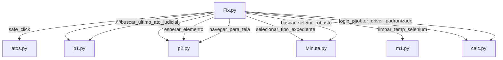

# Usage Maps

## Fix.py Function Calls Across Project

```mermaid
graph TD
    Fix.py -->|safe_click| atos.py
    Fix.py -->|safe_click| p1.py
    Fix.py -->|safe_click| p2.py
    Fix.py -->|esperar_elemento| p2.py
    Fix.py -->|navegar_para_tela| p2.py
    Fix.py -->|buscar_ultimo_ato_judicial| p1.py
    Fix.py -->|selecionar_tipo_expediente| Minuta.py
    Fix.py -->|buscar_seletor_robusto| Minuta.py
    Fix.py -->|limpar_temp_selenium| m1.py
    Fix.py -->|login_pje_robusto| calc.py
    Fix.py -->|obter_driver_padronizado| calc.py
```
